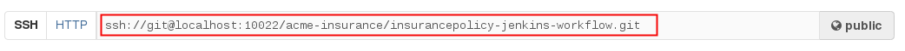
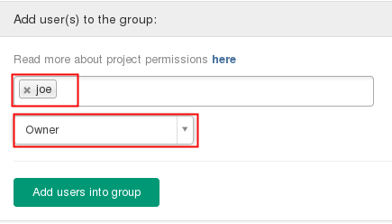
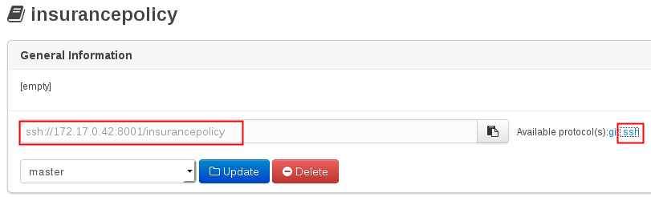
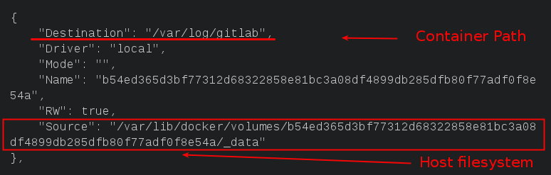

:data-uri:
:toc: manual
:toc-placement: preamble
:jenkins: https://wiki.jenkins-ci.org/display/JENKINS/Use+Jenkins[Jenkins]
:docker: https://docs.docker.com/[Docker]
:gitlab: http://doc.gitlab.com/ce/[Git Lab]
:bxmscicdvm: http://brokern[BxMS CI CD virtual machine]
:virtualbox: link:https://www.virtualbox.org/wiki/Downloads[Virtual Box]
:gitignore_template: link:https://gist.github.com/jbride/e578ebafe754fd2d0072[.gitignore template]
:workflow_plugin: link:https://wiki.jenkins-ci.org/display/JENKINS/Workflow+Plugin[Jenkins Workflow Plugin]

= BxMS CI / CD using Jenkins

.Goals.
. Investigation of CI / CD workflows of business processes and rules using *Jenkins*

:numbered:

== Overview
This reference architecture investigates the use of {jenkins} to orchestrate CI / CD workflows of business processes and rules.

This reference architecture is particularly relevant to software developers already proficient with Jenkins and hosted Git repositories (such as Github or {gitlab}).
The approach would most likely not be utilized in use cases where the majority of users of Red Hat's `BPM Suite` were business analysts.

Highlights of this `Jenkins` focused approach are as follows:

. Master branch of BPM projects is always in a deployable state.
. Can be fully automated (as per principals of Continuous Delivery and DevOps)
. System of truth of version controlled BxMS artifacts are the repositories managed in a custom `GitLab` environment.
. Every developer has their own local BPMS instance.

== Pre-Requisites

=== Skills
. Experience developing and deploying applications in Red Hat's `BPM Suite` product.
. Experience with {jenkins}.
. Experience with {docker}.
+
This lab exercise makes use of Docker.
All of the components (ie:  Jenkins, BPM Suite, GitLab, Nexus ) of the solution are wrapped and deployed within Docker containers.
`Docker-compose` is used to orchestrate the start-up and shut-down of the containers.

=== Resources
The resource requirements to run this lab are extensive.
Many operating system processes will be spawn.
Please ensure that your host lab environment (ie:  local workstation or cloud environment) meets these minimum requirements:

. 10 GB RAM
. 4 CPUs (64 bit)
. 25 GB disk space
. 64-bit {virtualbox} (optional if running the lab in your local workstation)

[[vm]]
== BxMS CI / CD Virtual Machine
In order to quickly get you productive with this lab, a virtual machine (pre-installed with all of the needed components) is provided.

The virtual machine that complements this lab is provided in two forms:

. `Red Hat Partner Demo System`
+
More information about acquiring a cloud based lab environment can be found in the appendix: <<pdsvm>>
. `Virtual Box`
+
More information about executing this lab in your local environment via Virtual Box can be found in the appendix: <<vbvm>>

These lab instructions assume you are making use of this virtual machine (either in the cloud or locally in Virtual Box).

=== Virtual Machine users
The following table lists the operating system users pre-configured on the virtual machine that compliments these lab instructions:

[width="100%",cols="1,2,4",options="header"]
|==============================================
|userId|password|notes
|jboss|jb0ssredhat!|Used for most operations in this lab instruction
|root|jb0ssredhat!|OS admin privledges
|==============================================

== Deployment Topology
The following diagram depicts the deployment topology of the components that make up this lab:

== Setup
This section of the lab assumes that :

. You have shell access to the <<vm>> that compliments these lab instructions.
. You are logged in as the `jboss` operating system user.

=== Docker accessibility
At start-up, Docker reverts its permissions so that only the `root` operating system user is authorized to execute `docker` commands.

In this lab, the pre-existing `jboss` should be allowed to execute `docker` commands.

The `jboss` user is already associated with the group: `dockerroot`.
Modify Docker permissions as follows such that those users in the `dockerroot` group are able to execute `docker` commands:

-----
sudo chgrp dockerroot /var/run/docker.sock
-----

NOTE:  This command will need to be executed every time the `docker` service is restarted (ie: when the host operating system is restarted).

=== *BxMS CI / CD* project
A clone of this project is already available on the <<vm>> in the `jboss` operating system user's home directory: `$HOME/bxms_ci_cd`.

This section can be skipped if using the <<vm>>.

If not using the `bxmscicd` virtual machine, this project can be cloned as follows:

. cd $HOME
. Execute:
+
-----
git clone https://github.com/jboss-gpe-ref-archs/bxms_ci_cd.git
-----

NOTE: For the purposes of this documentation, the name _$REF_ARCH_HOME_ refers to the root directory of this cloned project (ie: `$HOME/bxms_ci_cd` ).

=== Docker images

==== Build
The <<vm>> already includes all of the needed Docker images to support this project.

This section can be skipped if using the `bxmscicd` virtual machine.

If not using the `bxmscicd` virtual machine, this project can be built as follows:

. Change directories into the folder where the source code to the project's images reside:
+
-----
cd $REF_ARCH_HOME/02_jenkins_cd/docker/
-----
. Review the details of the project's build script:
+
-----
vi project_build.sh
-----
. Build BxMS CI / CD images
+
-----
./project_build.sh
-----

==== Review
A listing of all of the Docker images supporting this project can be viewed as follows:

-----
docker images
-----

=== BxMS Storage image
The majority of the Docker components that make up this lab exercise need persistent storage.
This persistent storage is provided by mounting to them an additional Docker image called: `bxmscicd-storage`.

==== Start-up
Execute as follows:

. Change directories into the folder where the source code to the project's images reside:
+
-----
cd $REF_ARCH_HOME/02_jenkins_cd/docker/
-----
. Start bxmscicd-storage container
+
-----
docker run -d --name=bxmscicd_storage bxmscicd-storage
-----
+
NOTE: After start-up, the `status` of the `bxmscicd-storage` container will be `Exited`.
This is normal behavior as the container does not run an operating system process and is only used to attach to other running containers.

==== Mount Paths
Persistent storage can be viewed on the host operating system.
The ability to view files in persistent storage will come in handy if/when troubleshooting the various components that make up this reference architecture.

More information (for reference purposes) can be found in the <<mountpaths>> section of the Appendix.

=== BxMS CI /s CD images
It's now time to start-up the components that make up this lab.

. If not already there, change directories to where the project's image source code resides:
+
-----
cd $REF_ARCH_HOME/02_jenkins_cd/docker/
-----
. Create and start `bxmscicd` containers from previously built images:
+
-----
docker-compose -p bpmscd up -d
-----

Generic life-cycle commands to control these components can be found in the appendix: <<docker_commands>>

== Procedure
Now that all components that make up this lab are running, its time to see Continuous Integration and Delivery of BxMS business processes and rules in action.

In order to gain access to the various components referenced in this section of the lab, please refer to the <<container_details>> section of the appendix.

=== Nexus: Configure `Public` Maven repo

=== GitLab: `joe` user

==== Create `joe`
. As per the <<webcontainerdetails>> section of the appendix, log in as the `root` user to the `bpmscd_gitlab_*` web application.
. Create a new user `joe`
.. From the top tool-bar, click the `Admin area` icon and navigate to `Users`
.. Click the green `New user` button.  Populate the form as follows:
... *Name*:  joe
... *username*: joe
... *Email*: provide a personal email address
.. At the bottom of the form, click the green `Create user` button.
.. Typically, a new user confirmation email would have been sent out to: `joe`.
+
This email would allow `joe` to create a new password.
+
For the purposes of this lab, the `GitLab` container is not configured to send emails.
Subsequently, `joe's` password will need to be set via the `GitLab` administrative panel.

... In the `Admin area` of GitLab, navigate to: `Users -> joe -> Edit`
+
image::images/joe_password.png[]
... Set a new password for `joe` and click the `Save changes` button at the bottom.

==== Assign `joe` to a group
. Create a group: `acme-insurance`
.. While still in the `Admin area`, click `Groups`
.. Click the green `New Group` button. Populate the form as follows:
... *Group name*: acme-insurance
.. At the bottom of the form, click the green `Create group` button.
.. Make the `joe` user an `Owner` of the new `acme-insurance` group:
+

=== GitLab: `jenkins` user
Similar to previous, create a new user in GitLab called: `jenkins`.
Assign the `jenkins` user to the group: `acme-insurance`.

=== BPM Suite: `insurancepolicy` repo

==== Clone
. As per the <<webcontainerdetails>> section of the appendix, log in as the `joe` user to the `business-central` web application of your `bpmscd_bpms-design-*` container.
. In the `Administrative` workbench, create a new `Organizational Unit` of: `acme` with a `Default GroupID` of `acme`.
. In the `Administrative` workbench, create a new git repository called `insurancepolicy` by cloning the existing repository at the following URL:
+
-----
https://github.com/gpe-mw-training/insurancepolicy
-----
+
Set the `Organizational Unit` of the new `insurancepolicy` repo to: `acme`.
. Make note of the ssh URL to the new `insurancepolicy` git repo :
+

. In the host operating system, open a terminal window, ensure that the the `jboss` operating system user is being used and in the user's $HOME directory, clone the `insurancepolicy` repository.
+
-----
git clone ssh://<docker host ip of bpmscd_bpms-design-* container>:8001/insurancepolicy
-----
+
When prompted, provide the password of the pre-configured `joe` user of BPM Suite (which is: `jb0ssredhat!` )

. Rename the URL to the BPM Suite git server to: `bpms`
+
-----
$ git remote -v
origin	git://172.17.0.42:9418/insurancepolicy (fetch)
origin	git://172.17.0.42:9418/insurancepolicy (push)

$ git remote add bpms ssh://172.17.0.42:8001/insurancepolicy
-----
+
NOTE: The ip address to your `bpmscd_bpms-design-*` container will mostly likely be different than this example above.

. Reset `origin` reference to `gitlab` URL
+
Let's now return back to the `policyquote` repo on the local filesystem and reset the URL of the `origin` reference such that it points to `gitlab`.

.. If not already there in a terminal window, return to: `$HOME/policyquote`.
.. Execute:
+
----
$ git remote set-url origin ssh://git@localhost:10022/acme-insurance/insurancepolicy.git

$ git remote -v
bpms	ssh://172.17.0.42:8001/insurancepolicy (fetch)
bpms	ssh://172.17.0.42:8001/insurancepolicy (push)
origin	ssh://git@localhost:10022/acme-insurance/insurancepolicy.git (fetch)
origin	ssh://git@localhost:10022/acme-insurance/insurancepolicy.git (push)
----

* jenkins image: configure git user settings
* jenkins: create SSH key, added to Credentials plugin
* gitlab: uploaded jenkins SSH key
* note: bpms-runtime -> no support for quartz
* jenkins: when running script from git repo, sandboxed by default. Permissions must be set in http://172.17.1.128:8080/scriptApproval/
* gitlab: added webhook in policyquote project `http://172.17.1.151:8080/git/notifyCommit?url=ssh://git@gitlab/acme-insurance/policyquote.git`

== Appendix

[[pdsvm]]
=== Partner Demo System VM

[[vbvm]]
=== Virtual Box VM

[[mountpaths]]
=== Storage Mount Paths
Persistent storage can be viewed on the host operating system.
The ability to view files in persistent storage will come in handy if/when troubleshooting the various components that make up this reference architecture.

. The persistent volumes of all Docker components utilized in this lab can be found on the host operating system at: `/var/lib/docker/volumes`.
To get a general sense of the current contents of this directory, execute the following:
+
-----
sudo tree /var/lib/docker/volumes
-----

. It's likely that the previous command returned a lot of output with no context regarding which files are used by which components of this project.
To understand the mapping between container paths and persistent volumes on the host operating system, execute the following:
.. Identify the mount path(s) utilized in the Docker container of interest:
+
-----
cat $REF_ARCH_HOME/02_jenkins_cd/docker/docker-compose.yml
-----
+
Notice the entries in the `Volumes` section defined in each container.
+
image::images/volumes.png[]
.. Inspect mount paths of container volumes:
+
-----
docker inspect bxmscicd_storage
-----
+
In particular, review the mappings defined in the `Mounts` JSON array.
.. In the `Mounts` JSON array, notice the mappings between the container `destination` and the `Source` directory (on the host file system), ie:
+

.. On the host operating system, view the container's files:
+
-----
ls /var/lib/docker/volumes/b54ed365d3bf77312d68322858e81bc3a08df4899db285dfb80f77adf0f8e54a
-----

[[docker_commands]]
=== Docker Container Commands

==== View containers

-----
docker ps -a
-----

==== Gain shell access to a running container
.. Using `docker ps -a`, select the name of the container to gain shell access to. ie; `docker_nexus_1`
.. Execute:
+
-----
sudo nsenter -m -u -n -i -p -t `docker inspect --format '{{ .State.Pid }}' docker_nexus_1` /bin/bash
-----

==== Stop all containers
.. If not already there, change directories to where the project’s image source code resides:
+
-----
cd $REF_ARCH_HOME/02_jenkins_cd/docker/
-----
+
-----
docker-compose -p bpmscd stop
-----

==== Delete all stopped containers

-----
docker rm $(docker ps -a -q)
-----

[[container_details]]
=== Container Details

[[webcontainerdetails]]
==== Web Containers Details
The follow table lists details of the various web components used in this lab.

NOTE: Replace `<fqdn>` with the fully qualified domain name of the host operating system where your lab environment resides; ie: `bxmscicd.ose.opentlc.com`.

.Web container details
[width="100%",cols="3,4,4,3",options="header"]
|==============================================
|Container|URL|Server Log|User Credentials (userId / passwd)
|bpmscd_nexus_1|<fqdn>:18080/nexus|/data/logs/nexus.log|admin / admin123
|bpmscd_bpms-design_1|<fqdn>:28080/business-central|/opt/jboss/bpms/standalone/log/server.log|joe / jb0ssredhat!
|bpmscd_bpms-qa_1|<fqdn>:38080/kie-server/services/rest/server||jbos / jb0ssredhat!
|bpmscd_bpms-prod_1|<fqdn>:48080/kie-server/services/rest/server||jboss / jb0ssredhat!
|bpmscd_gitlab_1|<fqdn>:10080|/var/log/gitlab/gitlab/application.log|root / 5iveL!fe
|bpmscd_jenkins_1|<fqdn>:8080||Security not enabled
|==============================================

==== MySQL RDBMS

-----
mysql -h <fqdn> -u jboss -p bpmsdesign
mysql -h <fqdn> -u jboss -p bpmstest
mysql -h <fqdn> -u jboss -p bpmsqa
mysql -h <fqdn> -u jboss -p bpmsprod
-----

Password for all of the above databases is: `jboss`

ifdef::showScript[]

endif::showScript[]
