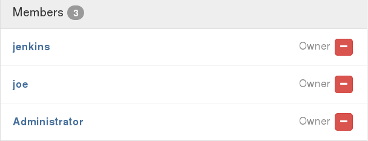
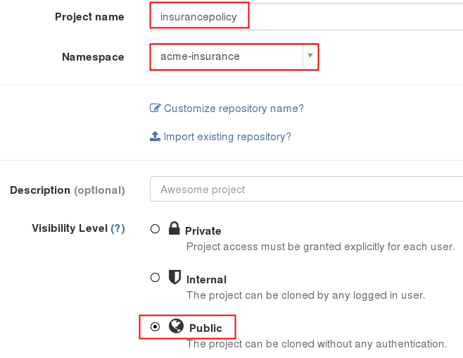
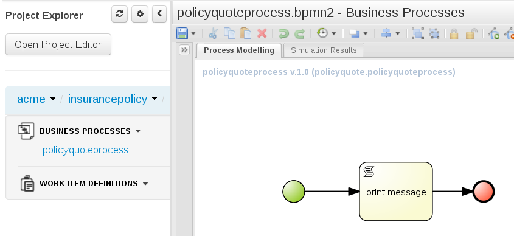
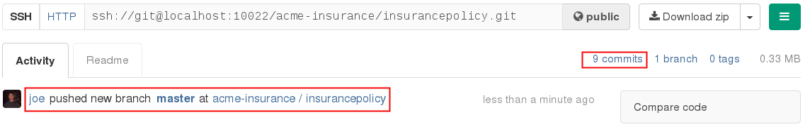
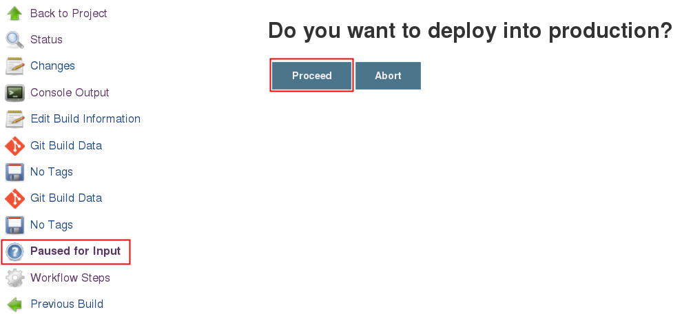

:data-uri:
:toc: manual
:toc-placement: preamble
:jenkins: https://wiki.jenkins-ci.org/display/JENKINS/Use+Jenkins[Jenkins]
:docker: https://docs.docker.com/[Docker]
:gitlab: http://doc.gitlab.com/ce/[Git Lab]
:bxmscicdvm: http://brokern[BxMS CI CD virtual machine]
:virtualbox: link:https://www.virtualbox.org/wiki/Downloads[Virtual Box]
:gitignore_template: link:https://gist.github.com/jbride/e578ebafe754fd2d0072[.gitignore template]
:workflow_plugin: link:https://wiki.jenkins-ci.org/display/JENKINS/Workflow+Plugin[Jenkins Workflow Plugin]
:jenkinsfile: link:https://github.com/gpe-mw-training/insurancepolicy-jenkins-workflow/blob/master/Jenkinsfile[Jenkinsfile]

= BxMS CI / CD using Jenkins

.Goals.
. Investigation of CI / CD workflows of business processes and rules using *Jenkins*

:numbered:

== Overview
This reference architecture investigates the use of {jenkins} to orchestrate CI / CD workflows of business processes and rules.

This reference architecture is particularly relevant to software developers already proficient with Jenkins and hosted Git repositories (such as Github or {gitlab}).
The approach would most likely not be utilized in use cases where the majority of users of Red Hat's `BPM Suite` were business analysts.

Highlights of this `Jenkins` focused approach are as follows:

. Master branch of BPM projects is always in a deployable state.
. Can be fully automated (as per principals of Continuous Delivery and DevOps)
. System of truth of version controlled BxMS artifacts are the repositories managed in a custom `GitLab` environment.
. Every developer has their own local BPMS instance.

== Pre-Requisites

=== Skills
. Experience developing and deploying applications in Red Hat's `BPM Suite` product.
. Experience with {jenkins}.
. Experience with {docker}.
+
This lab exercise makes use of Docker.
All of the components (ie:  Jenkins, BPM Suite, GitLab, Nexus ) of the solution are wrapped and deployed within Docker containers.
`Docker-compose` is used to orchestrate the start-up and shut-down of the containers.

=== Resources
The resource requirements to run this lab are extensive.
Many operating system processes will be spawn.
Please ensure that your host lab environment (ie:  local workstation or cloud environment) meets these minimum requirements:

. 10 GB RAM
. 4 CPUs (64 bit)
. 25 GB disk space
. 64-bit {virtualbox} (optional if running the lab in your local workstation)

[[vm]]
== BxMS CI / CD Virtual Machine
In order to quickly get you productive with this lab, a virtual machine (pre-installed with all of the needed components) is provided.

The virtual machine that complements this lab is provided in two forms:

. `Red Hat Partner Demo System`
+
More information about acquiring a cloud based lab environment can be found in the appendix: <<pdsvm>>
. `Virtual Box`
+
More information about executing this lab in your local environment via Virtual Box can be found in the appendix: <<vbvm>>

These lab instructions assume you are making use of this virtual machine (either in the cloud or locally in Virtual Box).

=== Virtual Machine users
The following table lists the operating system users pre-configured on the virtual machine that compliments these lab instructions:

[width="100%",cols="1,2,4",options="header"]
|==============================================
|userId|password|notes
|jboss|jb0ssredhat!|Used for most operations in this lab instruction
|root|jb0ssredhat!|OS admin privledges
|==============================================

== Deployment Topology
The following diagram depicts the deployment topology of the components that make up this lab:

== Setup
This section of the lab assumes that :

. You have shell access to the <<vm>> that compliments these lab instructions.
. You are logged in as the `jboss` operating system user.

NOTE: For the purposes of this documentation, the name _$REF_ARCH_HOME_ refers to the root directory of this project in your lab environment(ie: `$HOME/bxms_ci_cd` ).

=== Build and Start

==== *BxMS CI / CD* project
A clone of this project is already available on the <<vm>> in the `jboss` operating system user's home directory: `$HOME/bxms_ci_cd`.

[blue]#*This section can be skipped if using the <<vm>>.*#

If not using the `bxmscicd` virtual machine, this project can be cloned as follows:

. cd $HOME
. Execute:
+
-----
git clone https://github.com/jboss-gpe-ref-archs/bxms_ci_cd.git
-----

==== Build images

The <<vm>> already includes all of the needed Docker images to support this project.

[blue]#*This section can be skipped if using the `bxmscicd` virtual machine.*#

If not using the `bxmscicd` virtual machine, this project can be built as follows:

. Change directories into the folder where the source code to the project's images reside:
+
-----
cd $REF_ARCH_HOME/02_jenkins_cd/docker/
-----
. Review the details of the project's build script:
+
-----
vi project_build.sh
-----
. Build BxMS CI / CD images
+
-----
./project_build.sh
-----

==== BxMS Storage image
The majority of the Docker components that make up this lab exercise need persistent storage.
This persistent storage is provided by creating and mounting an additional Docker image called: `bxmscicd-storage`.

===== Start-up
Execute as follows:

. Change directories into the folder where the source code to the project's images reside:
+
-----
cd $REF_ARCH_HOME/02_jenkins_cd/docker/
-----
. Start bxmscicd-storage container
+
-----
docker run -d --name=bxmscicd_storage bxmscicd-storage
-----
+
NOTE: After start-up, the `status` of the `bxmscicd-storage` container will be `Exited`.
This is normal behavior as the container does not run an operating system process and is only used to attach to other running containers.

===== Mount Paths
Persistent storage can be viewed on the host operating system.
The ability to view files in persistent storage will come in handy if/when troubleshooting the various components that make up this reference architecture.

More information (for reference purposes) can be found in the <<mountpaths>> section of the Appendix.

==== BxMS CI / CD images: startup
It's now time to start-up the components that make up this lab.

. If not already there, change directories to where the project's image source code resides:
+
-----
cd $REF_ARCH_HOME/02_jenkins_cd/docker/
-----
. Create and start `bxmscicd` containers from previously built images:
+
-----
docker-compose -p bpmscd up -d
-----

As a reference, generic docker life-cycle commands to control these newly spun-up containers can be found in the appendix: <<docker_commands>>

=== BxMS CI / CD Customization
Now that all components that make up this lab are running, its now time to make some environment specific customizations to the BxMS CI / CD components.

In order to gain access to the various components referenced in this section of the lab, please refer to the <<container_details>> section of the appendix.

==== Nexus: Configure `Public` Maven repo
Ensure that Nexus is configured such that its `Public Repositories` serves as a reverse proxy to all public Red Hat JBoss Maven repositories.

. As per the <<webcontainerdetails>> section of the appendix, log in as the `admin` user to the `Nexus` container.
. Navigate to: `Repositories -> Public Repositories -> Configuration`.
. Ensure that the set of `Ordered Group Repositories` includes the following:
.. *Releases*
.. *Central*
.. *JBoss Enterprise*
.. *JBoss Public*
.. *JBoss Public Snapshots*
.. *Snapshots*
+
image::images/nexus_public.png[width="70%"]
. Click the `Save` button at the bottom of the page.

You have finished configuring `Nexus`.

==== GitLab: `joe` user
This lab exercise, a BPM / Java developer whose name is `joe` utilizes the Red Hat BPM product to create and run business processes and rules.

`joe` needs the ability to push his changes (in the master branch of the `insurancepolicy` git repo) to the version control system, `GitLab`, that `joe` and his team have selected to collaborate amongst eachother on.

===== Create `joe`
. As per the <<webcontainerdetails>> section of the appendix, log in as the `root` user to the `bpmscd_gitlab_*` web application.
+
NOTE:  You will be prompted to change the `root` user's password immediately after the first login.
So as to be consistent with most of the passwords used in this lab, its recommended that the Gitlab root user's password be changed to: `jb0ssredhat!`.

. Create a new user `joe`
.. From the top tool-bar, click the `Admin area` icon and navigate to `Users`
.. Click the green `New user` button.  Populate the form as follows:
... *Name*:  joe
... *username*: joe
... *Email*: provide any email (this email is never ued in this lab
.. At the bottom of the form, click the green `Create user` button.
.. Typically, a new user confirmation email would have been sent out to: `joe`.
+
This email would allow `joe` to create a new password.
+
For the purposes of this lab, the `GitLab` container is not configured to send emails.
Subsequently, `joe's` password will need to be set via the `GitLab` administrative panel.

... In the `Admin area` of GitLab, navigate to: `Users -> joe -> Edit`
+
image::images/joe_password.png[]
... Set a new password (ie: `jb0ssredhat!`) for `joe` and click the `Save changes` button at the bottom.

===== Assign `joe` to a group
. Create a group: `acme-insurance`
.. While still in the `Admin area`, click `Groups`
.. Click the green `New Group` button. Populate the form as follows:
... *Group name*: acme-insurance
.. At the bottom of the form, click the green `Create group` button.
.. Make the `joe` user an `Owner` of the new `acme-insurance` group:
+
image::images/acme_group.png[]

==== GitLab: `jenkins` user
Similar to previous, create a new user in GitLab called: `jenkins`.
Assign the `jenkins` user to the group: `acme-insurance`.

The `acme-insurance` group should now include the following members:

This `jenkins` user in `gitlab` will allow the `jenkins` component of this lab to automatically pull the latest changes pushed by developers such as `joe`.

==== GitLab: Public ssh keys for `joe` and `jenkins`
The `ssh` protocol is used to push and pull code to/from the git repositories in `GitLab`.

In this section of the lab, public ssh keys will be registered with the newly created `joe` and `jenkins` users in GitLab.

NOTE: SSH key pairs for both `joe` and `jenkins` have already been generated in the <<vm>>.
These SSH key pairs are located at: `home/jboss/.ssh`.

Execute the following for both `joe` and `jenkins`.

. Log out of `Gitlab` and log back in as the newly created user (`joe` and `jenkins`).
. In the top toolbar of `gitlab`, navigate to: `Profile Settings -> ssh keys`
. Click the green `Add SSH Key` button
. In a terminal window execute, `cat $HOME/.ssh/id_joe.pub`, as the `jboss` operating system user:
+
-----
$ cat $HOME/.ssh/id_joe.pub
ssh-rsa AAAAB3NzaC1yc2EAAAADAQABAAABAQDB+ZjbhwaOX5nN606CAjPP3GNLNc5Bd8ZTmjmRB5Oz7LXLorZaar26gPM7kPgJmk7JYpsabCmQ6GHUO5BxBmR2ZZE7uwxmqEaOPAKJakerfIAxI7Gh1DcPtKjq+TmOWoBJBzKVKsw/9fwCwGth5aMynH46TcP2kl9rSEH/zaWV6Zx8Iw0Wx683F1KZ9tNR57/lPlrfn4EYDPPY5qXQC2ThPLetORQ9Dcw7JFYcLAblcTfFNnX1DyusaqcN8WMcDCCl99o1BHMu/yOaUpX/B5VKdNQzq8+dovs/1LW0Ey2qZXkZKpO8wRbKd2GK4IBEAD+lvDtRJnJA0ggT+hpdBSar jboss@rhel7
-----
. Copy and paste the entire public key into the `key` text box in the `GitLab` form.
+
image::images/key_gitlab.png[]
. Press the green `Add Key` button at the bottom of the form.
. Repeat the above for the `jenkins` user.
+
Note that the public key for the `jenkins` user is located at: `$HOME/.ssh/id_jenkins.pub`.

===== GitLab: `insurancepolicy` git repo
In this lab, all developers are colaborating in a git repository called: `insurancepolicy`.
Each developers has her/his own development environment where commits are being added to their local autonomous `insurancepolicy` git repo.

As a manner of convention however, the development team has decided to collaborate amongst one another via a shared `insurancepolicy` git repository in `GitLab`.

In this section, the `insurancepolicy` git repository will be created:

. As any user (`joe`, `jenkins` or `root` ..... since they are all memebers of the same group: `acme-insurance`), click the `New Project` button in the top toolbar of `GitLab`.
. Populate the form as follows:
.. *Project name*: `insurancepolicy`
.. *Namespace:* `acme-insurance`
.. *Visibility Level:* `Public`
+

. Click the green `Create project` at the bottom of the form.

Congratulations!  You have completed with configuration of GitLab.

==== BPM Suite: `insurancepolicy` repo
The `bpmscd_bpms-design-*` container needs to be seeded with an existing `insurancepolicy` repo that contains a single BPMN2 process definition.

. As per the <<webcontainerdetails>> section of the appendix, log in as the `joe` user to the `business-central` web application of your `bpmscd_bpms-design-*` container.
. In the `Administrative` workbench, create a new `Organizational Unit` of: `acme` with a `Default GroupID` of `acme`.
. In the `Administrative` workbench, create a new git repository called `insurancepolicy` by cloning the existing repository at the following URL:
+
-----
https://github.com/gpe-mw-training/insurancepolicy
-----
+
Set the `Organizational Unit` of the new `insurancepolicy` repo to: `acme`.
. Make note of the ssh URL to the new `insurancepolicy` git repo :
+
image::images/ssh_url.png[]
+
NOTE: Pay particular attention to the ip address of the `bpmscd_bpms-design` container provided in this URL.
It will be used in subsequent sections of this lab.
. If interested, switch to the `Project Authoring` section of BPM Suite, and review the simple BPMN process definition called: `policyquoteprocess`.
+

==== Local filesystem: `insurancepolicy` repo

. In the host operating system, open a terminal window, ensure that the the `jboss` operating system user is being used and in the user's $HOME directory, clone the `insurancepolicy` repository.
+
-----
git clone ssh://<docker host ip of bpmscd_bpms-design-* container>:8001/insurancepolicy
-----
+
When prompted, provide the password of the pre-configured `joe` user of BPM Suite (which is: `jb0ssredhat!` )

. Create a new remote reference to the git repo of `bpmscd_bpms-design-*` and name it: `bpms`:
+
-----
$ git remote -v
origin	git://172.17.0.42:9418/insurancepolicy (fetch)
origin	git://172.17.0.42:9418/insurancepolicy (push)

$ git remote add bpms ssh://172.17.0.42:8001/insurancepolicy
-----
+
NOTE: The ip address to your `bpmscd_bpms-design-*` container will mostly likely be different than this example above.

. Reset `origin` reference to `gitlab` URL
+
Let's now return back to the `insurancepolicy` repo on the local filesystem and reset the URL of the `origin` reference such that it points to `gitlab`.

.. If not already there in a terminal window, return to: `$HOME/policyquote`.
.. Execute:
+
----
$ git remote set-url origin ssh://git@localhost:10022/acme-insurance/insurancepolicy.git

$ git remote -v
bpms	ssh://172.17.0.42:8001/insurancepolicy (fetch)
bpms	ssh://172.17.0.42:8001/insurancepolicy (push)
origin	ssh://git@localhost:10022/acme-insurance/insurancepolicy.git (fetch)
origin	ssh://git@localhost:10022/acme-insurance/insurancepolicy.git (push)
----

. Push the existing commits in the `insurancepolicy` repo to GitLab:
+
-----
git push origin master
-----
. In GitLab, navigate to the `insurancepolicy` project and very that the commits exist.
+

Congratulations! You are done configuring the BPMS-design container and your local `insurancepolicy` git repository.

==== Jenkins
The `Jenkins` container provided as part of this lab is pre-configured a job called: `bpms-cicd`.
The `bpms-cicd` job leverages the {workflow_plugin} to orchestrate continuous integration and delivery of business process and rules from `Dev` -> `QA` -> `Prod`.

For the purposes of this lab, no additional Jenkins configuration changes are needed.
However, it is important to review and understand the `bpms-cicd` job.
To do, so execute the following:

. As per the <<webcontainerdetails>> section of the appendix, navigate to your `Jenkins` container. (Security is disabled by default).
+
image::images/jenkins_job.png[]
. Click on `bpms-cicd` link and on the left panel of the `Workflow bpms-cicd` page, click `Configure`.
. The `bpms-cicd` Jenkins job itself is actually quite simple.
+
In essence, it delegate all CI/CD logic to the workflow plugins and a custom Groovy script called: {jenkinsfile}.

== BxMS CI/CD: Manual Execution
Now that all set-up and configuration has been completed, its now time to see CI / CD of business processes and rule in action.
We'll begin by manually triggering the workflow pipeline.
In the next section, a git `webhook` will be added that automates the triggering of the workflow pipeline.

. In `jenkins`, navigate to the `bpms-cicd` project.
. In the left panel, click `Build Now`.
. Notice in the `Build History` panel, a new job is kicked off.
+
image::images/jenkins_build_kickoff.png[]
+
NOTE:  Most likely your job # will be different.
. Click this latest incomplete job and in the left panel of the job home page, click: `Console Output`.
+
Monitor the log to get a general feel of the various actions executed by the Groovy workflow {jenkinsfile} script.
. After a while, the workflow job will have completed its build and testing of the `policyquote` BPM project.
+
Subsequently, it will proceed with deployment to `QA` and finally to `production`.
The Groovy script is configured to prompt a human user for approval to `production`.
You'll see this prompt at the bottom of the `Console Output` or by noticing in the top left panel of the job the following new link: `Paused for Input`.
+
image::images/paused_for_input.png[]
. In either case, when prompted for approval to production, click `Proceed`.
+

The workflow plugin will then push the built `policyquote` artifact to the `RESTful` deployment API of the BPM server in production.

Congratulations! You have manually triggered the CI / CD workflow of a BPM business process using Jenkins, Gitlab, Nexus and Red Hat BPM Suite.

== BxMS CI/CD: Automated Execution
An important principle of Continuous Delivery and DevOps is to automate workflow processes as much as possible.

In this final section, a `webhook` will be added to `gitlab` such that the `bpms_cicd` job in `Jenkins` will be automatically triggered.
This trigger will occur when a new commit is pushed to the `insurancepolicy` repo of `gitlab`.

=== Add web hook
. Determine local Docker ip address of the `bpmscd_jenkins_1` container.
+
This ip address will be used when defining a `webhook` in Gitlab and notifies `Jenkins` of an event.

.. Return to a terminal window in the <<vm>>
.. Execute:
+
----
docker inspect bpmscd_jenkins_1 | grep IPAddress | cut -d '"' -f 4
----
.. Make note of the Docker assigned ip address of the `Jenkins` container.

. Log into `Gitlab` (as any user in the `acme-insurance` group) and navigate to: `Projects -> acme-insurance/insurancepolicy -> Edit`.
. In the left panel of the `Project settings` page, select: `Web Hooks`.
. Populate the `Web hooks` form as follows:
.. *URL*: http://<jenkins_ip_addr>:8080/git/notifyCommit?url=ssh://git@gitlab/acme-insurance/insurancepolicy.git
.. *Trigger*: `Push events`
+
image::images/add_webhook.png[width="80%"]
+
NOTE: The ip address of your Jenkins container will likely be different from that depicted in the above illustration.
. Click the green `Add Web Hook` button

=== Create and push commit in `insurancepolicy`
Let's envision that `joe` has been working on the process definition and rules artifacts version controlled in the `insurancepolicy` git repository.
`joe` makes these changes and executes unit tests in his local environment.

Periodically, `joe` is ready to share his changes with the rest of the development team.
In the spirit of `Continuous Delivery / DevOps`, `Joe's` changes could be pushed as a new `release` to the `QA` and `Production` environments.
`joe` is responsible for owning the behavior of these latest changes in the `Production` environment.

Let's now simulate `joe's` changes:

. Return to a terminal window in the <<vm>> and switch user's to `jboss`.
. Change directory in the locally cloned `insurancepolicy` project on the local filesystem:
+
----
cd $HOME/insurancepolicy
----
. Edit the `readme.md`
+
This change to the project `readme.md` will serve as a simplistic simulation of `joe's` typical changes to the project's business process definitions and rules.
+
-----
$ echo "this change was made on `date`" >> readme.md
-----
. Notice that git now indicates a modified file in the working directory.
. Add and commit this change to the `.git` repo of the local project:
+
-----
$ git commit -am 'simulating a change made by joe'
-----
. Push commit to `gitlab`:
+
-----
git push origin master
-----
. Return to the `Jenkins` web app and notice that a new `job` to the `bpms-cicd` project has been automatically initiated.
+
image::images/jenkins_auto.png[width="70%"]
. Click on the latest `job`, and when prompted authorize the release to be deployed to production.

Congratulations! You have successfully implemented a Continuous Integration and Delivery workflow into the software development lifecycle of your business processes and rules.

== Appendix

[[pdsvm]]
=== Partner Demo System VM

[[vbvm]]
=== Virtual Box VM

[[mountpaths]]
=== Storage Mount Paths
Persistent storage can be viewed on the host operating system.
The ability to view files in persistent storage will come in handy if/when troubleshooting the various components that make up this reference architecture.

. The persistent volumes of all Docker components utilized in this lab can be found on the host operating system at: `/var/lib/docker/volumes`.
To get a general sense of the current contents of this directory, execute the following:
+
-----
sudo tree /var/lib/docker/volumes
-----

. It's likely that the previous command returned a lot of output with no context regarding which files are used by which components of this project.
To understand the mapping between container paths and persistent volumes on the host operating system, execute the following:
.. Identify the mount path(s) utilized in the Docker container of interest:
+
-----
cat $REF_ARCH_HOME/02_jenkins_cd/docker/docker-compose.yml
-----
+
Notice the entries in the `Volumes` section defined in each container.
+
image::images/volumes.png[]
.. Inspect mount paths of container volumes:
+
-----
docker inspect bxmscicd_storage
-----
+
In particular, review the mappings defined in the `Mounts` JSON array.
.. In the `Mounts` JSON array, notice the mappings between the container `destination` and the `Source` directory (on the host file system), ie:
+
image::images/mount_mappings.png[]
.. On the host operating system, view the container's files:
+
-----
ls /var/lib/docker/volumes/b54ed365d3bf77312d68322858e81bc3a08df4899db285dfb80f77adf0f8e54a
-----

[[docker_commands]]
=== Docker Commands

==== View Images
A listing of all of the Docker images supporting this project can be viewed as follows:

-----
docker images
-----

==== View containers

-----
docker ps -a
-----

==== Gain shell access to a running container
.. Using `docker ps -a`, select the name of the container to gain shell access to. ie; `docker_nexus_1`
.. Execute:
+
-----
sudo nsenter -m -u -n -i -p -t `docker inspect --format '{{ .State.Pid }}' docker_nexus_1` /bin/bash
-----

==== Stop all containers
.. If not already there, change directories to where the project’s image source code resides:
+
-----
cd $REF_ARCH_HOME/02_jenkins_cd/docker/
-----
+
-----
docker-compose -p bpmscd stop
-----

==== Delete all stopped containers

-----
docker rm $(docker ps -a -q)
-----

[[container_details]]
=== Container Details

[[webcontainerdetails]]
==== Web Containers Details
The follow table lists details of the various web components used in this lab.

NOTE: Replace `<fqdn>` with the fully qualified domain name of the host operating system where your lab environment resides; ie: `bxmscicd.ose.opentlc.com`.

.Web container details
[width="100%",cols="3,4,4,3",options="header"]
|==============================================
|Container|URL|Server Log|User Credentials (userId / passwd)
|bpmscd_nexus_1|<fqdn>:18080/nexus|/data/logs/nexus.log|admin / admin123
|bpmscd_gitlab_1|<fqdn>:10080|/var/log/gitlab/gitlab/application.log|root / 5iveL!fe
|bpmscd_jenkins_1|<fqdn>:8080||Security not enabled
|bpmscd_bpms-design_1|<fqdn>:28080/business-central|/opt/jboss/bpms/standalone/log/server.log|joe / jb0ssredhat!
|bpmscd_bpms-qa_1|<fqdn>:38080/kie-server/services/rest/server||jbos / jb0ssredhat!
|bpmscd_bpms-prod_1|<fqdn>:48080/kie-server/services/rest/server||jboss / jb0ssredhat!
|==============================================

==== MySQL RDBMS

-----
mysql -h <fqdn> -u jboss -p bpmsdesign
mysql -h <fqdn> -u jboss -p bpmstest
mysql -h <fqdn> -u jboss -p bpmsqa
mysql -h <fqdn> -u jboss -p bpmsprod
-----

Password for all of the above databases is: `jboss`

ifdef::showScript[]

endif::showScript[]
