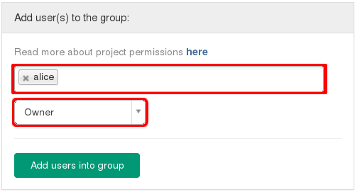
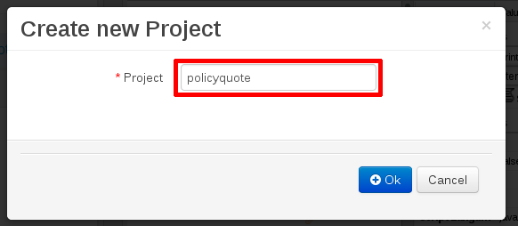
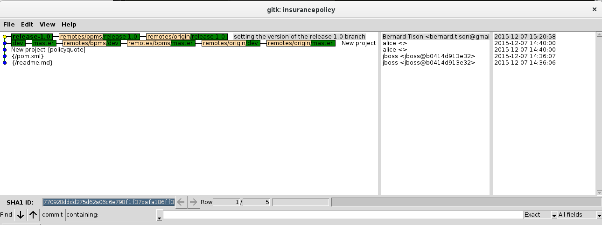
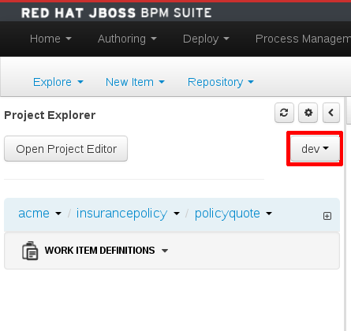
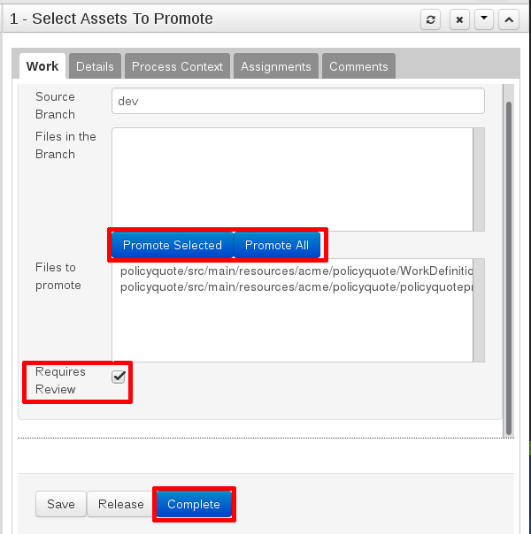
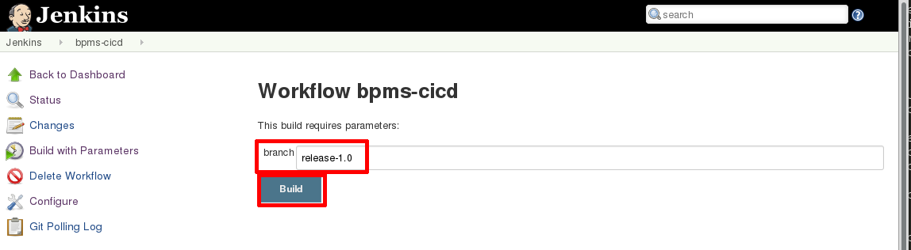
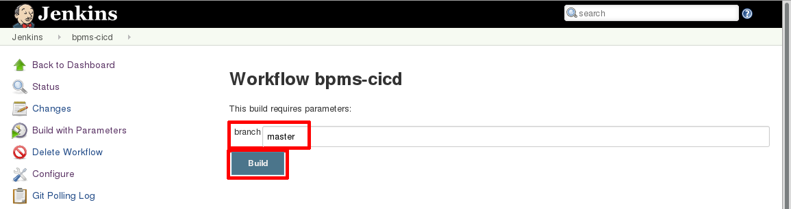

:noaudio:
:title: BxMS CI / CD - BPMS Driven Delivery
:sectanchors:
:toc: macro
:toclevels: 2
:toc-title: Table of Content
:jenkins: https://wiki.jenkins-ci.org/display/JENKINS/Use+Jenkins[Jenkins]
:docker: https://docs.docker.com/[Docker]
:gitlab: http://doc.gitlab.com/ce/[Git Lab]
:bxmscicdvm: http://brokern[BxMS CI CD virtual machine]
:virtualbox: link:https://www.virtualbox.org/wiki/Downloads[Virtual Box]
:gitignore_template: link:https://gist.github.com/jbride/e578ebafe754fd2d0072[.gitignore template]
:workflow_plugin: link:https://wiki.jenkins-ci.org/display/JENKINS/Workflow+Plugin[Jenkins Workflow Plugin]
:jenkinsfile: link:https://github.com/gpe-mw-training/insurancepolicy-jenkins-workflow/blob/master/Jenkinsfile[Jenkinsfile]
:versions_maven_plugin: link:http://www.mojohaus.org/versions-maven-plugin/[Versions Maven Plugin]

= {title}

toc::[]

.Goals
. Investigation of CI / CD workflows of business processes and rules using innate tooling of Red Hat `BPM Suite`

:numbered:

== Assumptions

. Most members of the development team are less technical, and/or have little or no experience with tools like git, maven.
. Development team uses BPMS as their primary development tool. The development team uses a shared BPMS instance
. All other tools involved in the CI/CD architecture (GitLab, Jenkins, Nexus, ...) are a given, and should not be a concern for the development team.
. The development team is only reponsible for developing process and/or rule artifacts. All supporting artifacts (data model, workitemhandlers, integration code, ...) are the responsibility of Java developer teams and have their own lifecycle and toolchains (this is according to the project structure as proposed by Justin Holmes). These suppporting artifacts are made available to BPMS projects through a Nexus server.

== Scenarios

=== Scenario 1 : Completely bpms-driven

In this scenario, only the BPMS tooling is used.

It relies on the managed repository functionality provided by BPMS to manage branches and promote or release development artifacts.

The development team consists of:

* 1 or more developers, responsible for creating development artifacts (process definitions, rule packages) (Joe, Jack)
* a release manager, responsible for promoting and releasing artifacts (Alice)

==== Development cycle

A typical development cycle could consist of:

* [Alice] [BPMS] +
Creates new repository in BPMS. The repository is of type _managed, multi-project_. +
Initial version is 1.0-SNAPSHOT. +
Branches are created by BPMS : master, release-1.0, dev-1.0

* [Alice] [BPMS] +
Creates new project in branch _dev-1.0_.

* [Joe] [BPMS] +
Does development in branch _dev-1.0_. +
When the result is satisfactory, starts the _promote_ workflow. +
The _promote_ workflow creates a user task for selection of artifacts to promote. +
Joe claims the task, sel
ects the artifacts, marks the task as _Requires review_. +
Joe completes the task. +
The _promote_ workflow creates a new human task for review.

* [Alice] [BPMS] +
Claims the _review_ task. +
Alice accepts the promotion request, and completes the task. +
Note: if Alice rejects the promotion request, the _promotion_ workflow loops back to the selecton task.
The _promote_ workflow advances the _release-1.0_ branch to the latest commit of the _dev-1.0_ that touches artifacts selected for promotion. +
Note : this is not cherry-picking or a merge. The HEAD of the _release-1.0_ branch is forcefully set to the selected commit of the _dev-1.0_ branch.

* [Alice,Joe] [BPMS] +
More iterations of the develop-promote workflow.

* [Alice] [BPMS] +
When the codebase is deemed ready for release, Alice starts the _release_ workflow. +
The _release_ workflow bumps the version of the _release-1.0_ branch to `1.0`. +
Alice launches the _configure_ workflow to create `dev-1.1` and `release-1.1` branches, using `dev-1.0` as starting point. +
Alice bumps the version in the project pom files to `1.1-SNAPSHOT` in the _dev-1.1_ branch.

* [Joe] [BPMS] +
Continues development in branch _dev-1.1_.

==== Integration with CI/CD pipeline

Possible integration points:

* Use support for _post-commit_ hooks in BPMS to synchronize the BPMS repo with the Gitlab repo. Jenkins pipeline triggered by web-hook in GitLab, or by polling job in Jenkins. +
The Jenkins pipeline is only triggered on changes in release branches.
* Use support for _post-commit_ hooks in BPMS to signal Jenkins directly.
* Use Jenkins polling job to react on commits in the BPMS git repo.

==== Discussion

* The built-in promote workflow is not merging or cherry-picking branches, but resets the head of the release branch. As such it is not possible to isolate commits. This becomes particularly problematic when there are several developers working on the same repository (even when working on different projects within the same repo). +
One way to overcome this, is to limit code promotion to a 'freeze the world' situation. All developers work on the dev branch. When the code is deemed ready to be promoted, no more changes to the development branch are allowed. The current state of the dev branch is promoted, build pipeline is triggered etc... Development is limited to stabilizing the release (fix issues in dev branch, promote fixes). Once the release is stabilized, development can be resumed.
* Initial testing of artifacts by the developer. This usually involves building and deploying the kjar. When several developers are working on the same project, unstable commits of one developer can prevent building and deploying by another developer. Also, to redeploy a kjar, it must first be undeployed. So developers cannot independently test their code. +
Workaround : have some BPMS instances running for testing purposes. When doing 'build and deploy', the developer can choose to deploy to one of the test instances.
* Git workflow : the proposed workflow is simplistic, as it only uses dev and release branches. A release can only be done from a release branch, but there is no merge to master. In most accepted git worklows, master corresponds to what is in production.
* CI/CD pipeline integration: BPMS post-commit hooks are fired for every commit (which in BPMS corresponds to every save operation), which makes it hard to use as trigger for a build pipeline, as it could easily flood the Jenkins system. +
Moreover, the _promote_ workflow does not involve commits to the git repo, so promotion of code would not trigger a build pipeline. +
A better approach is to have Jenkins poll the git repo for changes in the release branch (needs to be tested).

==== Conclusion

Relying on the built-in functionalities of BPMS for code promotion and release management might work in the simplest of scenarios, with only one developer working on a repo at any moment in time. +
On bigger teams, the limitations imposed on testing, code promotion, release cycle etc hampers efficiency.

=== Scenario 2 : Partially bpms-driven

In this scenario, a combination of BPMS tooling  and git command line tooling is used. It relies on the managed repository functionality provided by BPMS, but does not use the built-in functionalities to manage branches and promote or release development artifacts.

In this scenario, the developers work exclusively in BPMS. The release manager however, relies on git tooling (comand line, graphical tool) for managing code promotions and releases. +
So while the developers are not exposed to git internals, the release manager needs appropriate git skills.

The development team consists of:

* 1 or more developers, responsible for creating development artifacts (process definitions, rule packages) (Joe, Jack)
* a release manager, responsible for promoting and releasing artifacts (Alice)

==== Development cycle

A typical development cycle could consist of:

* [Alice] [BPMS] +
Creates new repository in BPMS. The repository is of type _managed, multi-project_. +
Initial version is 1.0-SNAPSHOT. +
Branches are not automatically created by BPMS +
Version master branch : 1.0-SNAPSHOT.

* [Alice] [Local] +
Clones repository from BPMS. +
Creates branches _dev_, _release-1.0_. +
Sets version of release branch to 1.0-rc-SNAPSHOT. +
Pushes _dev_, _release_ branches to BPMS. +
Pushes repository to central repository (GitLab).

* [Alice] [BPMS] +
Creates new project in branch _dev_.

* [Joe] [BPMS] +
Does development in branch _dev_. +
When the result is satisfactory, starts the _promote_ workflow. +
The _promote_ workflow creates a user task for selection of artifacts to promote. +
Joe claims the task, selects the artifacts, marks the task as _Requires review_. +
Joe completes the task. +
The _promote_ workflow creates a new human task for review.

* [Alice] [BPMS] +
Claims the _review_ task. +
Alice accepts the promotion request, but does not complete the task. Instead she aborts the process instance. +

* [Alice] [Local] +
Alice cherry picks (or merges if possible) the commits to be promoted from the _dev_ to the _release_ branch. +
The _release_ branch is pushed to BPMS, and to the central Git repository. +
The changes on the release branch in the central Git repository trigger a build pipeline on Jenkins.

* [Alice,Joe,Jack] [BPMS] +
More iterations of the develop-promote workflow.

* [Alice] [Local] +
When the codebase in the _release_ branch is deemed ready for production, Alice merges the _release_ branch to _master_. +
Bumps the version of the _master_ branch to 1.0. +
Bumps the version of the _dev_ branch to 1.1-SNAPSHOT +
Note: the maven version plugin can be used  to help with version management. There are also more specialized maven plugins for support of GitFlow-like branching and versioning strategies.
Creates a new _release-1.1_ branch with version 1.1-rc-SNAPSHOT +
Pushes the _master_ branch to the central repository. This triggers a build pipeline on Jenkins. +
Pushes the _dev_, _release-1.1_ and _master_ to BPMS.
If the _master_ branch build pipeline and subsequent tests are successful, the branch is tagged for production. The _release-1.0_ branch is no longer used from that point on.

* [Joe,Jack] [BPMS] +
Continue development on the _dev_ branch,
Code is promoted to _release-1.1_ when appropriate.

==== Integration with CI/CD pipeline

* Jenkins is integrated with the central Git repository through web hooks on the repository side, or through a polling job in Jenkins.
* The Jenkins pipeline is triggered by changes in _release-x.x_ and _master_ branches, which are in a deployable state.

==== Discussion

* Usage of a shared version of BPMS makes testing by the developer harder. This does not change compared to the first scenario.
* The git branching strategy and version management is more close to generally accepted workflows like GitFlow. Ongoing development is happening in a development branch. Release branches are shortlived branches that contain the code for the next release. The master branch reflects what is deployed in production.

==== Conclusion

Combining development in BPMS with code promotion and release supported by specialized tools (git command line, maven plugins) allows to shield less technical developers from git and maven, while still allowing for an acceptable release and version management.
The fact that there might be several developers working on the same BPMS repository is less problematic than in the first scenario, as the promotion to the release branch can be done by cherry-picking. But it should be noted that cherry-picking is in general more error-prone than merging branches. However, merging would require that individual developers can isolate their ongoing work in feature branches. In the current state of the BPMS tooling this approach cannot be achieved without the developer being skilled with git skills and tooling.

== Pre-Requisites

=== Skills
. Experience developing and deploying applications in Red Hat's `BPM Suite` product.
. Experience with {jenkins}.
. Experience with {docker}.
+
This lab exercise makes use of Docker.
All of the components (ie:  Jenkins, BPM Suite, GitLab, Nexus ) of the solution are wrapped and deployed within Docker containers.
`Docker-compose` is used to orchestrate the start-up and shut-down of the containers.

=== Resources
The resource requirements to run this lab are extensive.
Many operating system processes will be spawn.
Please ensure that your host lab environment (ie:  local workstation or cloud environment) meets these minimum requirements:

. 10 GB RAM
. 4 CPUs (64 bit)
. 25 GB disk space
. 64-bit {virtualbox} (optional if running the lab in your local workstation)

[[vm]]
== BxMS CI / CD Virtual Machine
In order to quickly get you productive with this lab, a virtual machine (pre-installed with all of the needed components) is provided.

The virtual machine that complements this lab is provided in two forms:

. `Red Hat Partner Demo System`
+
More information about acquiring a cloud based lab environment can be found in the appendix: <<pdsvm>>
. `Virtual Box`
+
More information about executing this lab in your local environment via Virtual Box can be found in the appendix: <<vbvm>>

These lab instructions assume you are making use of this virtual machine (either in the cloud or locally in Virtual Box).

=== Virtual Machine users
The following table lists the operating system users pre-configured on the virtual machine that compliments these lab instructions:

[width="100%",cols="1,2,4",options="header"]
|==============================================
|userId|password|notes
|jboss|jb0ssredhat!|Used for most operations in this lab instruction
|root|jb0ssredhat!|OS admin privledges
|==============================================

== Deployment Topology
The following diagram depicts the deployment topology of the components that make up this lab:

== Setup
This section of the lab assumes that :

. You have shell access to the <<vm>> that compliments these lab instructions.
. You are logged in as the `jboss` operating system user.

NOTE: For the purposes of this documentation, the name _$REF_ARCH_HOME_ refers to the root directory of this project in your lab environment(ie: `$HOME/bxms_ci_cd` ).

=== Build and Start

==== *BxMS CI / CD* project
A clone of this project is already available on the <<vm>> in the `jboss` operating system user's home directory: `$HOME/bxms_ci_cd`.

[blue]#*This section can be skipped if using the <<vm>>.*#

If not using the `bxmscicd` virtual machine, this project can be cloned as follows:

. cd $HOME
. Execute:
+
-----
git clone https://github.com/jboss-gpe-ref-archs/bxms_ci_cd.git
-----

==== Build images

The <<vm>> already includes all of the needed Docker images to support this project.

[blue]#*This section can be skipped if using the `bxmscicd` virtual machine.*#

If not using the `bxmscicd` virtual machine, this project can be built as follows:

. Change directories into the folder where the source code to the project's images reside:
+
-----
cd $REF_ARCH_HOME/02_jenkins_cd/docker/
-----
. Review the details of the project's build script:
+
-----
vi project_build.sh
-----
. Build BxMS CI / CD images
+
-----
./project_build.sh
-----

==== BxMS Storage image
The majority of the Docker components that make up this lab exercise need persistent storage.
This persistent storage is provided by creating and mounting an additional Docker image called: `bxmscicd-storage`.

===== Start-up
Execute as follows:

. Change directories into the folder where the source code to the project's images reside:
+
-----
cd $REF_ARCH_HOME/02_jenkins_cd/docker/
-----
. Start bxmscicd-storage container
+
-----
docker run -d --name=bxmscicd_storage bxmscicd-storage
-----
+
NOTE: After start-up, the `status` of the `bxmscicd-storage` container will be `Exited`.
This is normal behavior as the container does not run an operating system process and is only used to attach to other running containers.

===== Mount Paths
Persistent storage can be viewed on the host operating system.
The ability to view files in persistent storage will come in handy if/when troubleshooting the various components that make up this reference architecture.

More information (for reference purposes) can be found in the <<mountpaths>> section of the Appendix.

==== BxMS CI / CD images: startup
It's now time to start-up the components that make up this lab.

. If not already there, change directories to where the project's image source code resides:
+
-----
cd $REF_ARCH_HOME/02_jenkins_cd/docker/
-----
. Create and start `bxmscicd` containers from previously built images:
+
-----
docker-compose -p bpmscd up -d
-----

As a reference, generic docker life-cycle commands to control these newly spun-up containers can be found in the appendix: <<docker_commands>>

=== BxMS CI / CD Customization
Now that all components that make up this lab are running, its now time to make some environment specific customizations to the BxMS CI / CD components.

In order to gain access to the various components referenced in this section of the lab, please refer to the <<container_details>> section of the appendix.

==== Nexus: Configure `Public` Maven repo
Ensure that Nexus is configured such that its `Public Repositories` serves as a reverse proxy to all public Red Hat JBoss Maven repositories.

. As per the <<webcontainerdetails>> section of the appendix, log in as the `admin` user to the `Nexus` container.
. Navigate to: `Repositories -> Public Repositories -> Configuration`.
. Ensure that the set of `Ordered Group Repositories` includes the following:
.. *Releases*
.. *Central*
.. *JBoss Enterprise*
.. *JBoss Public*
.. *JBoss Public Snapshots*
.. *Snapshots*
+
image::images/nexus_public.png[width="70%"]
. Click the `Save` button at the bottom of the page.

You have finished configuring `Nexus`.

==== GitLab: `alice` user

In this lab exercise, `alice` is the release manager of the development team, which for the rest consists mainly of process and rule developers with little of no knowledge of tools like version control or build and deployment servers. `joe` and his colleagues work directly on a shared BPMS instance. It is the responsibility of `alice` to synch their work with the version control system, in our case `GitLab`.

===== Create `alice`
. As per the <<webcontainerdetails>> section of the appendix, log in as the `root` user to the `bpmscd_gitlab_*` web application.
+
NOTE:  You will be prompted to change the `root` user's password immediately after the first login.
So as to be consistent with most of the passwords used in this lab, its recommended that the Gitlab root user's password be changed to: `jb0ssredhat!`.

. Create a new user `alice`
.. From the top tool-bar, click the `Admin area` icon and navigate to `Users`
.. Click the green `New user` button.  Populate the form as follows:
... *Name*:  alice
... *username*: alice
... *Email*: provide any email (this email is never ued in this lab)
.. At the bottom of the form, click the green `Create user` button.
.. Typically, a new user confirmation email would have been sent out to: `alice`.
+
This email would allow `alice` to create a new password.
+
For the purposes of this lab, the `GitLab` container is not configured to send emails.
Subsequently, `alice's` password will need to be set via the `GitLab` administrative panel.

... In the `Admin area` of GitLab, navigate to: `Users -> alice -> Edit`
+
image::images/alice_password.png[]
... Set a new password (ie: `jb0ssredhat!`) for `alice` and click the `Save changes` button at the bottom.

===== Assign `alice` to a group
. Create a group: `acme-insurance`
.. While still in the `Admin area`, click `Groups`
.. Click the green `New Group` button. Populate the form as follows:
... *Group name*: acme-insurance
.. At the bottom of the form, click the green `Create group` button.
.. Make the `alice` user an `Owner` of the new `acme-insurance` group:
+

==== GitLab: `jenkins` user
Similar to previous, create a new user in GitLab called: `jenkins`.
Assign the `jenkins` user to the group: `acme-insurance`.

The `acme-insurance` group should now include the following members:

image::images/gitlab_members_1.png[]

This `jenkins` user in `gitlab` will allow the `jenkins` component of this lab to automatically pull the latest changes pushed by developers such as `alice`.

==== GitLab: Public ssh keys for `alice` and `jenkins`
The `ssh` protocol is used to push and pull code to/from the git repositories in `GitLab`.

In this section of the lab, public ssh keys will be registered with the newly created `alice` and `jenkins` users in GitLab.

NOTE: SSH key pairs for both `alice` and `jenkins` have already been generated in the <<vm>>.
These SSH key pairs are located at: `home/jboss/.ssh`.

Execute the following for both `alice` and `jenkins`.

. Log out of `Gitlab` and log back in as the newly created user (`alice` and `jenkins`).
. In the top toolbar of `gitlab`, navigate to: `Profile Settings -> ssh keys`
. Click the green `Add SSH Key` button
. In a terminal window execute, `cat $HOME/.ssh/id_alice.pub`, as the `jboss` operating system user:
+
-----
$ cat $HOME/.ssh/id_alice.pub
ssh-rsa AAAAB3NzaC1yc2EAAAADAQABAAABAQDB+ZjbhwaOX5nN606CAjPP3GNLNc5Bd8ZTmjmRB5Oz7LXLorZaar26gPM7kPgJmk7JYpsabCmQ6GHUO5BxBmR2ZZE7uwxmqEaOPAKJakerfIAxI7Gh1DcPtKjq+TmOWoBJBzKVKsw/9fwCwGth5aMynH46TcP2kl9rSEH/zaWV6Zx8Iw0Wx683F1KZ9tNR57/lPlrfn4EYDPPY5qXQC2ThPLetORQ9Dcw7JFYcLAblcTfFNnX1DyusaqcN8WMcDCCl99o1BHMu/yOaUpX/B5VKdNQzq8+dovs/1LW0Ey2qZXkZKpO8wRbKd2GK4IBEAD+lvDtRJnJA0ggT+hpdBSar jboss@rhel7
-----
. Copy and paste the entire public key into the `key` text box in the `GitLab` form.
+
image::images/key_gitlab.png[]
. Press the green `Add Key` button at the bottom of the form.
. Repeat the above for the `jenkins` user.
+
Note that the public key for the `jenkins` user is located at: `$HOME/.ssh/id_jenkins.pub`.

===== GitLab: `insurancepolicy` git repo
In this lab, all developers are collaborating in a shared BPMS instance, on a BPMS internal git repository called: `insurancepolicy`.

However, in accordance to organisation policies, all code needs to be versioned controlled in a central git repository in `GitLab`. It is the responsibility of `Alice` to ensure that the BPMS internal git repository and the central repository are kept in sync (we might also explore ways to have this process automated)

In this section, the `insurancepolicy` git repository will be created:

. As any user (`alice`, `jenkins` or `root` ..... since they are all members of the same group: `acme-insurance`), click the `New Project` button in the top toolbar of `GitLab`.
. Populate the form as follows:
.. *Project name*: `insurancepolicy`
.. *Namespace:* `acme-insurance`
.. *Visibility Level:* `Public`
+
image::images/gitlab_create_project.png[]
. Click the green `Create project` at the bottom of the form.

Congratulations!  You have completed with configuration of GitLab.

==== BPM Suite: `insurancepolicy` repo and project

A new repository and project need to be created in BPMS.

. As per the <<webcontainerdetails>> section of the appendix, log in as the `alice` user to the `business-central` web application of your `bpmscd_bpms-design-*` container.
. In the `Administrative` workbench, create a new `Organizational Unit` of: `acme` with a `Default GroupID` of `acme`.
. In the `Administrative` workbench, create a new git repository called `insurancepolicy`. In the `Repositories` menu, choose `new repository`. In the dialog box, fill in `insurancepolicy` as the name of the repository. +
Set the `Organizational Unit` of the new `insurancepolicy` repo to: `acme`. +
Make sure to check the `Managed Repository` checkbox. This option will give us the needed support for branches in BPMS. +
Click `Next`.
+
image::images/bpms_create_managed_repo.png[]

. On the next screen, select `Multi_project Repository`. +
Uncheck the `Automatically Configure Branches` checkbox. We'll configure the branching structure for our project later on. +
Keep the suggested value for `Name`, `Group` and `Artifact`. +
Set the `Version` to *1.0-SNAPSHOT*.
+
image::images/bpms_create_managed_repo_2a.png[]
+
image::images/bpms_create_managed_repo_2b.png[]
+
Click `Finish`.

. Make note of the ssh URL to the new `insurancepolicy` git repo :
+
image::images/ssh_url.png[]
+
NOTE: Pay particular attention to the ip address of the `bpmscd_bpms-design` container provided in this URL.
It will be used in subsequent sections of this lab.

. Switch to the `Project Authoring` section of BPM Suite, and in the `New Item` menu, click `Project`. +
In the dialog box, fill in *policyquote* as project name. +
+

+
Review the `New Project` screen, and click `Finish`.

==== Local filesystem: `insurancepolicy` repo

As mentioned in the previous chapter, all developers will work on a shared instance of BPMS. As part of her role as release manager, `Alice` needs to synch the internal BPMS repo with the central Git repository hosted on GitLab. To do so, she will need to clone the BPMS repo to her local file system, and push from the local file system to the GitLab repo. As part of the initial setup of the project, she also needs to define the git branch structure.

. In the host operating system, open a terminal window, ensure that the `jboss` operating system user is being used and in the user's $HOME directory, clone the `insurancepolicy` repository.
+
-----
git clone ssh://alice@172.17.0.64:8001/insurancepolicy
-----
+
When prompted, provide the password of the pre-configured `alice` user of BPM Suite (which is: `jb0ssredhat!` )

. `cd` to `$HOME/insurancepolicy`
. Rename the 'origin' remote reference pointing to the git repo of `bpmscd_bpms-design-*` to `bpms`:
+
-----
$ git remote -v
origin	ssh://alice@172.17.0.64:8001/insurancepolicy (fetch)
origin	ssh://alice@172.17.0.64:8001/insurancepolicy (push)

$ git remote rename origin bpms
-----
+
NOTE: The ip address to your `bpmscd_bpms-design-*` container will mostly likely be different than this example above.

. Create `origin` remote pointing to `gitlab` URL. +
Execute:
+
----
$ git remote add origin ssh://git@localhost:10022/acme-insurance/insurancepolicy.git

$ git remote -v
bpms	ssh://172.17.0.42:8001/insurancepolicy (fetch)
bpms	ssh://172.17.0.42:8001/insurancepolicy (push)
origin	ssh://git@localhost:10022/acme-insurance/insurancepolicy.git (fetch)
origin	ssh://git@localhost:10022/acme-insurance/insurancepolicy.git (push)
----

. Now `alice` needs to create the git branch structure to support the development workflow. +
As discussed above, developers work on a developer branch. When development artifacts are in a good enough shape to be included in a release, the code is promoted to a release branch. When the codebase in the release branch is ready for production, it is merged into the master branch. In summary:
** `dev` branch : ongoing developement work.
** `release-x.y` branch : holds the codebased for the next release, with version x.y.
** `master` : reflects what is running in production.

. Create the branch structure on the local filesystem:
.. In a terminal, navigate to `$HOME/insurancepolicy`.
.. Create the dev and release branch:
+
----
$ git branch dev
$ git branch release-1.0
----
+
.. Using the {versions_maven_plugin}, set the maven version in the release branch to `1.0-rc-SNAPSHOT`. This is to be able to differentiate release candidate builds from SNAPSHOT development builds.
+
----
$ git checkout release-1.0
Switched to branch 'release-1.0'

$ mvn versions:set -DnewVersion=1.0-rc-SNAPSHOT -DgenerateBackupPoms=false

$ git add --all
$ git commit -m "setting version of release-1.0 branch"
----
+
.. Push the `dev` and `release-1.0` branches to bpms:
+
----
$ git push bpms release-1.0
$ git push bpms dev
----
+
.. Push the  `master`, `dev` and `release-1.0` branches to bpms:
+
----
$ git push origin master
$ git push origin release-1.0
$ git push origin dev
----
+
.. Using a graphical git tool like `gitk`, review the git project structure at this point:
+

. In GitLab, navigate to the `insurancepolicy` project and verify that the commits exist.
+
image::images/gitlab_verify_commits.png[]

Congratulations! You are done configuring the BPMS-design container and your local `insurancepolicy` git repository.

==== Jenkins

The `Jenkins` container provided as part of this lab is pre-configured a job called: `bpms-cicd`. +
The `bpms-cicd` job leverages the {workflow_plugin} to orchestrate continuous integration and delivery of business process and rules from `Dev` -> `QA` -> `Prod`.

For the purposes of this lab, no additional Jenkins configuration changes are needed.
However, it is important to review and understand the `bpms-cicd` job.
To do, so execute the following:

. As per the <<webcontainerdetails>> section of the appendix, navigate to your `Jenkins` container. (Security is disabled by default).
+
image::images/jenkins_job.png[]
. Click on `bpms-cicd` link and on the left panel of the `Workflow bpms-cicd` page, click `Configure`.
. The `bpms-cicd` Jenkins job itself is actually quite simple.
+
In essence, it delegates all CI/CD logic to the workflow plugins and a custom Groovy script called: {jenkinsfile}.

The {workflow_plugin} allows to describe complex build and deployment pipelines as Groovy scripts, which themselves can be maintained in a SCM (pipeline-as-code). +
Our `bpms-cicd` job leverages one Groovy script for both release as production builds. The script can be found in the `jenkins-workflow-script` folder of this project.

Some things to note:

* The release and production builds are very similar, but not totally the same. +
The release builds stops after deployment to a QA BPM Suite execution server target. +
The production build deploys to a QA instance, and if flagged as ok (by e.g. the QA manager), proceeds to deploy the build artifacts to a production instance of the BPM Suite execution server.
* To make the distinction between the two builds, the `bpms-cicd` job is a parametrized build, taking the git branch name as a parameter. If the branch name to build starts with `release`, a release build is triggered. If the branch name is `master`, a production build is started.
* The branch name is used within the Groovy script together with `if-then-else` Groovy structures to drive the build.
* As an alternative, we could have setup two jobs, one for release and one for production, reusing the same workflow script. We leave this as an exercise for the reader.

The `bpms-cicd` job expects to find the Groovy build script in GitLab, in a project called `insurancepolicy-jenkins-workflow`. +
To set up this project:

. Log into GitLab as user `alice`.
. Create a new project in the `acme-insurance` namespace. Name the project `insurancepolicy-jenkins-workflow`. Make sure the project visibility is `public`.
. Clone the new project on your local filesystem
+
----
$ git clone ssh://git@localhost:10022/acme-insurance/insurancepolicy-jenkins-workflow.git
----
. Copy the `Jenkinsfile` file from the `jenkins-workflow-script` folder of this project to the root of the cloned `insurancepolicy-jenkins-workflow` repo.
. Add, commit and push
+
----
$ git add Jenkinsfile
$ git commit -m "Jenkinsfile"
$ git push origin master
----

== BxMS CI/CD: Development Workflow

With everything set-up, and configuration completed, we can now experience the complete development workflow in action.

=== Developer

. As per the <<webcontainerdetails>> section of the appendix, log in as the `joe` user to the `business-central` web application of your `bpmscd_bpms-design-*` container.
. Navigate to the `Authoring` perspective. In the `Project Explorer` window, make sure that the `dev` branch is selected:
+

+
Also, when selecting the `Repository -> Repository structure` menu option, make sure the `dev` branch structure is actually shown.
+
image::images/repository_structure_dev_branch.png[] 

. As an example of ongoing development work, create a simple business process in the `policyquote` project. Save your work.

. The first version of your process definiton is ready, and can be promoted to the release branch.
.. To initiate the promotion process, select `Repository -> Repository structure`. In the `Repository Structure` window, click the `Promote` button.
+
image::images/repository_structure_promote.png[]
+
.. In the dialog window, select `release-0.1` as target branch. Click `OK`.
+
image::images/repository_promote_target_branch.png[]
+
.. The `Promote` action kicked off an instance of a business process containing a human task where `joe` will select the assets for promotion. +
Navigate to `Tasks -> Task list`. +
Select the `Active` filter. You should see one task there, with task name `Select Assets To Promote`. Click the `Claim` button to claim the task.
+
image::images/promote_claim_task.png[]
+
.. In the task form, check the artifacts you want to promote. If `joe` is the only developer working on this project, this probably means all artifacts can be selected. If other developers are also working on the `dev` branch of the project, `joe` will have to select his artifacts from the list. +
Make sure to select the `Mark for review` checkbox.
+

+
.. Click the `Complete` button to complete the task.

The process advances to the next human task, called `Review`. +
Note that this new task also shows up in `joe` task list. This is because both the `Promote` as the `Review` task have the _kiemgmt_ group as potential owner. Both `joe` and `alice` belong to this group. +
However, `joe` should not claim the review task, but rather leave it to `alice`.

While `joe` 's assets are under review, he can continue working on other parts of the project.

=== Release manager

. As per the <<webcontainerdetails>> section of the appendix, log in as `alice` to the `business-central` web application of your `bpmscd_bpms-design-*` container.
. Navigate to the Task list.
. Claim the `Review` task initiated by `joe`. +
The task form lists `joe` 's commits to be reviewed. +
Note that there is no easy way to link these commits to actual project assets, so `alice` will have to clone the dev branch locally and use a git tool like `gitk` to link the commits to projects assets.
. As `alice`, open a terminal and navigate to `$HOME/insurancepolicy` - which is the location of the local clone of the repository.
. Review `joe` 's commits
.. Fetch the BPM Suite repository:
+
----
$ git fetch bpms
----
+
.. Merge the local `dev` branch with the `dev` branch from BPM Suite
+
----
$ git checkout dev
$ git merge bpms/dev
----
+
.. Use the `gitk` tool to correlate `joe` 's commits with project artifacts, and review `joe` 's work. +
If unsatisfactory, the `Promote` workflow can return to `joe` - to do so, in the task form in business central, do not check the `Approved` check box, and complete the task. This will create a new human task to be claimed by `joe`. +
For the sake of this exercise, let's assume the review is positive.

. Promote `joe` 's work to the release branch
.. Check out the `release-1.0` branch:
+
----
$ git checkout release-1.0
----
+
.. Cherry-pick `joe` 's commits. + 
Probably the easiest way to do so is through the `gitk` tool.
Select a commit to promote - if several commits need to be cherry-picked, pick the oldest first. +
Right-click on the commit, and select `Cherry-pick this commit`. +
The changes in the commit are added to the `release-1.0` branch.
+
image::images/cherry-pick_commit.png[]
+
Repeat for all commits in `joe` 's promotion request.

.. Push the `release-1.0` branch to BPM Suite and Gitlab
+
----
$ git push bpms release-1.0
$ git push origin release-1.0
----
+
.. The git repository structure now looks like:
+
image::images/gitk_release.png[]

. Abort the `PromoteAssets` process instance +
As discussed above, the `PromoteAssets` built-in process is not well suited for managing the proper promotion of commits from one branch to another - it does a hard reset of the HEAD pointer of the target branch to the source branch, which is rarely what we really want. +
So `alice`, rather than continuing the `Promote` proces instance after reviewing and accepting `joe` 's commits, needs to abort the process instance.
.. in BPMS (still logged in as `alice`), go to `Process Management -> Process Instances`.
.. In the list of running process instances, locate the instance of the `PromoteAssets` process `alice` is currently working one.
.. Abort the instance by clicking the `Abort` button in the row corresponding to the process instance.

. Kick off a release build in Jenkins. +
For the moment, the `bpms-cicd` build job in Jenkins needs to be manually triggered (we'll fix that later on).
.. In `jenkins`, navigate to the `bpms-cicd` project.
.. In the left panel, click `Build With Parameters`.
.. In the Workflow window, make sure the `branch` parameter is set to value *release-1.0*. +
+

+
Click `Build`.
.. Notice in the `Build History` panel, a new job is kicked off.
+
image::images/jenkins_build_kickoff.png[]
+
NOTE:  Most likely your job # will be different.
.. Click this latest incomplete job and in the left panel of the job home page, click: `Console Output`.
+
Monitor the log to get a general feel of the various actions executed by the Groovy workflow {jenkinsfile} script.
.. After a while, the workflow job will have completed its build and testing of the `policyquote` BPM project.
+
Subsequently, it will proceed with deployment to `QA`. +
The Groovy script is configured to prompt a human user for acknowledgement of the `QA` deployment. The idea is here that someone, e.g. the _Test Manager_ of the team, flags the build as passed or not depending on manual test results. +
You'll see this prompt at the bottom of the `Console Output` or by noticing in the top left panel of the job the following new link: `Paused for Input`.
+
image::images/paused_for_input.png[]
.. In either case, when prompted for approval to production, click `Proceed`.
+
image::images/paused_for_input_2.png[width="50%"]
.. At this point, the build pipeline is finished.

== BxMS CI/CD: Production release

At a certain point, the code base in the release branch is feature complete and stabilized, and can be promoted to production. +
As the release manager, `alice` will merge the current release branch into the master branch, bump up the maven version number in the `master` branch, and finally push the `master` branch to the central git repo, from where a build pipeline will be kicked off in Jenkins resulting ultimately into an automated deployment into production.

At this point, our git repo structure looks like:

image::images/git_before_merge_master.png[]

. As `alice`, open a terminal and navigate to `$HOME/insurancepolicy` - which is the location of the local clone of the repository.
. Make sure the local copy of the git repository is up-to-date with the central repo on Gitlab - this should normally be the case.
. Check out the `master` branch
+
----
$ git checkout master
----
. Merge the `release-1.0` branch into the `master` branch.
+
----
$ git merge --no-ff release-1.0 
----  
+
Note: the `--no-ff` flag creates a merge commit even when the merge resolves as a fast-forward. This helps to keep an overview of what exactly is being put into a production release.

. Using the {versions_maven_plugin}, set the maven version in the `master` branch to `1.0`.
+
----
$ git checkout master
$ mvn versions:set -DnewVersion=1.0 -DgenerateBackupPoms=false

$ git add --all
$ git commit -m "setting version of master branch to 1.0"
---- 
. Push the `master` branch to the central git repository
+
----
$ git push origin master
----

. Kick off a production build in Jenkins. +
For the moment, the `bpms-cicd` build job in Jenkins needs to be manually triggered (we'll fix that later on).
.. In `jenkins`, navigate to the `bpms-cicd` project.
.. In the left panel, click `Build With Parameters`.
.. In the Workflow window, make sure the `branch` parameter is set to value *master*. +
+

+
Click `Build`.
.. Notice in the `Build History` panel, a new job is kicked off.
+
image::images/jenkins_build_kickoff.png[]
+
NOTE:  Most likely your job # will be different.
.. Click this latest incomplete job and in the left panel of the job home page, click: `Console Output`.
+
Monitor the log to get a general feel of the various actions executed by the Groovy workflow {jenkinsfile} script.
.. After a while, the workflow job will have completed its build and testing of the `policyquote` BPM project.
+
Subsequently, it will proceed with deployment to `QA`. +
The Groovy script is configured to prompt a human user for approval to `production`. The idea is here that someone, e.g. the _Test Manager_ of the team, flags the build as passed or not depending on manual test results. +
If passed, the build pipeline proceeds with deployment to production. +
You'll see this prompt at the bottom of the `Console Output` or by noticing in the top left panel of the job the following new link: `Paused for Input`.
+
image::images/paused_for_input.png[]
.. In either case, when prompted for approval to production, click `Proceed`.
+
image::images/jenkins_proceed.png[width="50%"]
+
The workflow plugin will then push the built `policyquote` artifact to the `RESTful` deployment API of the BPM server in production.

Next, `alice` prepares the environment for the next development iteration. This involves creating a new release branch off the `master` branch, and bumping up the maven version in the `dev` branch.

. As `alice`, open a terminal and navigate to `$HOME/insurancepolicy` - which is the location of the local clone of the repository.
. Branch off the release branch of the next release off master:
+
----
$ git checkout master
$ git checkout -b release-1.1
----
. Using the {versions_maven_plugin}, set the maven version in the `release-1.1` branch to *1.1-rc-SNAPSHOT*.
+
----
$ mvn versions:set -DnewVersion=1.1-rc-SNAPSHOT -DgenerateBackupPoms=false

$ git add --all
$ git commit -m "setting version of release-1.1 branch" 
----
. Push the `release-1.1` branch to BPM Suite
+
----
$ git push bpms release-1.1
---- 
. Bump up the version in the dev branch. Make sure you have the latest from the `dev` branch on BPM Suite, as during the whole release process, developers might have added or modified assets in the `dev` branch:
+
----
$ git fetch bpms
$ git checkout dev
$ git merge bpms/dev
$ mvn versions:set -DnewVersion=1.1-SNAPSHOT -DgenerateBackupPoms=false
$ git add --all
$ git commit -m "setting version of the dev branch"
$ git push bpms dev
----

From this point on, code promotions from the `dev` branch should target the `release-1.1` branch. When the time has come to release into production, the `release-1.1` branch will be merged into `master`. And so on...

== BxMS CI/CD: Automated Execution
An important principle of Continuous Delivery and DevOps is to automate workflow processes as much as possible.

In this final section, a custom git _post-receive_ hook will be added to the `insurancepolicy` repo on GitLab  such that the `bpms_cicd` job in `Jenkins` will be automatically triggered. +
This trigger will occur when a new commit is pushed to the `insurancepolicy` repo of GitLab. +
We cannot leverage a web hook here, as we need to make the distinction between a release build (triggered when pushed to a `release-x.x` branch) and a production build (when pushed to the `master` branch). A webhook does not allow to pass along the name of the branch as a build parameter to Jenkins.

=== Add git post-receive hook

. Determine local Docker ip address of the `bpmscd_jenkins_1` container.
+
This ip address will be used when defining a custom in Gitlab and notifies `Jenkins` of an event.

.. Return to a terminal window in the <<vm>>
.. Execute:
+
----
docker inspect bpmscd_jenkins_1 | grep IPAddress | cut -d '"' -f 4
----
.. Make note of the Docker assigned ip address of the `Jenkins` container.

. Using the instructions in <<mountpaths>>, locate the Source directory of the GitLab container - the one corresponding to `home/git/data`.
. Open a terminal, switch to `root` user, and navigate to the mounted volume.
+
----
# cd /var/lib/docker/volumes/b54ed365d3bf77312d68322858e81bc3a08df4899db285dfb80f77adf0f8e54a/_data
# ls -l
----
+
You should see something like:
+
image::images/gitlab_data_dir.png[]

. Navigate to the root of the `insurancepolicy` git repository
+
----
# cd repositories/acme-insurance/insurancepolicy.git
----

. Create a directory `custom_hooks`, create a file named `post-receive` in that directory, and set the appropriate permissions
+
----
# mkdir custom_hooks
# touch custom_hooks/post-receive
# chown -R 1500:1500 custom_hooks
# chmod 775 custom_hooks/post-receive
----

. Open the `post-receive` file for edit with `vi`, and paste the following contents:
+
----
#!/bin/bash

while read oldrev newrev refname
do
    branch=$(git rev-parse --symbolic --abbrev-ref $refname)
    echo $(date) >> /home/git/data/tmp/test.txt
    if [[ "$branch" == "master" || "$branch" == release* ]]; then
    	curl -X GET http://172.17.0.63:8080/job/bpms-cicd-release/buildWithParameters?branch=${branch}
    fi
done
----
+
Make sure to replace the IP address with the correct IP address of the Jenkins container as determined above.

. Save the `post-receive` file.

=== Create and push commit in `insurancepolicy`

You can now simulate a development cycle as described above. +
You'll notice that whenever `alice` pushes code to the `release-x.y` or the `master` branch in GitLab, a build is automatically triggered in Jenkins.

Congratulations! You have successfully implemented a Continuous Integration and Delivery workflow into the software development lifecycle of your business processes and rules.

== Appendix

[[pdsvm]]
=== Partner Demo System VM

[[vbvm]]
=== Virtual Box VM

[[mountpaths]]
=== Storage Mount Paths
Persistent storage can be viewed on the host operating system.
The ability to view files in persistent storage will come in handy if/when troubleshooting the various components that make up this reference architecture.

. The persistent volumes of all Docker components utilized in this lab can be found on the host operating system at: `/var/lib/docker/volumes`.
To get a general sense of the current contents of this directory, execute the following:
+
-----
sudo tree /var/lib/docker/volumes
-----

. It's likely that the previous command returned a lot of output with no context regarding which files are used by which components of this project.
To understand the mapping between container paths and persistent volumes on the host operating system, execute the following:
.. Identify the mount path(s) utilized in the Docker container of interest:
+
-----
cat $REF_ARCH_HOME/02_jenkins_cd/docker/docker-compose.yml
-----
+
Notice the entries in the `Volumes` section defined in each container.
+
image::images/volumes.png[]
.. Inspect mount paths of container volumes:
+
-----
docker inspect bxmscicd_storage
-----
+
In particular, review the mappings defined in the `Mounts` JSON array.
.. In the `Mounts` JSON array, notice the mappings between the container `destination` and the `Source` directory (on the host file system), ie:
+
image::images/mount_mappings.png[]
.. On the host operating system, view the container's files:
+
-----
ls /var/lib/docker/volumes/b54ed365d3bf77312d68322858e81bc3a08df4899db285dfb80f77adf0f8e54a
-----

[[docker_commands]]
=== Docker Commands

==== View Images
A listing of all of the Docker images supporting this project can be viewed as follows:

-----
docker images
-----

==== View containers

-----
docker ps -a
-----

==== Gain shell access to a running container
.. Using `docker ps -a`, select the name of the container to gain shell access to. ie; `docker_nexus_1`
.. Execute:
+
-----
sudo nsenter -m -u -n -i -p -t `docker inspect --format '{{ .State.Pid }}' docker_nexus_1` /bin/bash
-----

==== Stop all containers
.. If not already there, change directories to where the project’s image source code resides:
+
-----
cd $REF_ARCH_HOME/02_jenkins_cd/docker/
-----
+
-----
docker-compose -p bpmscd stop
-----

==== Delete all stopped containers

-----
docker rm $(docker ps -a -q)
-----

[[container_details]]
=== Container Details

[[webcontainerdetails]]
==== Web Containers Details
The follow table lists details of the various web components used in this lab.

NOTE: Replace `<fqdn>` with the fully qualified domain name of the host operating system where your lab environment resides; ie: `bxmscicd.ose.opentlc.com`.

.Web container details
[width="100%",cols="3,4,4,3",options="header"]
|==============================================
|Container|URL|Server Log|User Credentials (userId / passwd)
|bpmscd_nexus_1|<fqdn>:18080/nexus|/data/logs/nexus.log|admin / admin123
|bpmscd_gitlab_1|<fqdn>:10080|/var/log/gitlab/gitlab/application.log|root / 5iveL!fe
|bpmscd_jenkins_1|<fqdn>:8080||Security not enabled
|bpmscd_bpms-design_1|<fqdn>:28080/business-central|/opt/jboss/bpms/standalone/log/server.log|joe / jb0ssredhat!
|bpmscd_bpms-qa_1|<fqdn>:38080/kie-server/services/rest/server||jbos / jb0ssredhat!
|bpmscd_bpms-prod_1|<fqdn>:48080/kie-server/services/rest/server||jboss / jb0ssredhat!
|==============================================

==== MySQL RDBMS

-----
mysql -h <fqdn> -u jboss -p bpmsdesign
mysql -h <fqdn> -u jboss -p bpmstest
mysql -h <fqdn> -u jboss -p bpmsqa
mysql -h <fqdn> -u jboss -p bpmsprod
-----

Password for all of the above databases is: `jboss`

'''

ifdef::showScript[]

endif::showScript[]
